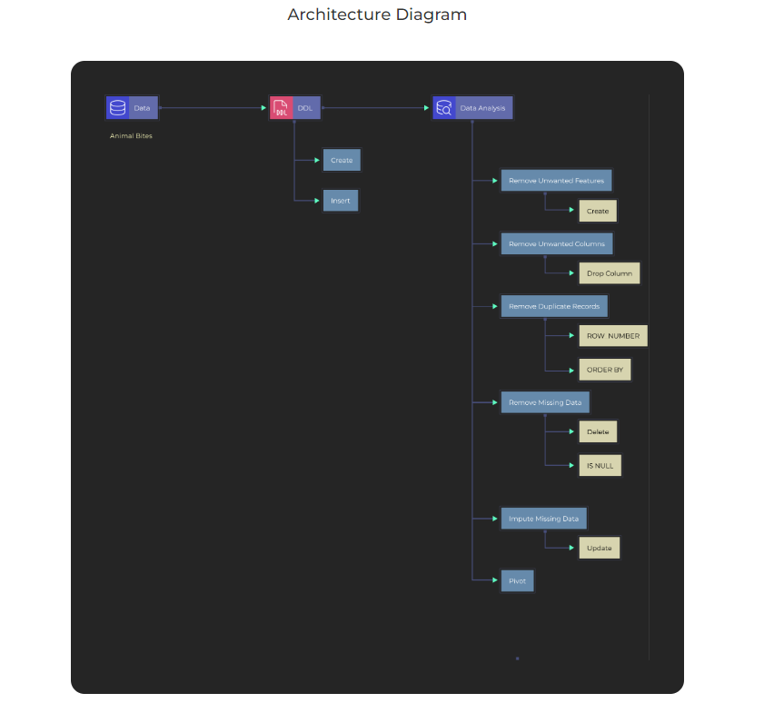

# SQL-Data-Analysis-Part-6
SQL Project for Data Analysis using Oracle Database-Part 6

# Project Description

### What is Dataset Analysis? 

Dataset Analysis is defined as manipulating or processing unstructured or raw data to draw valuable insights and conclusions that will help derive critical decisions that add some business value. The dataset analysis process is followed by organizing the dataset, transforming the dataset, visualizing the dataset, and finally modeling the dataset to derive predictions for solving the business problems, making informed decisions, and effectively planning for the future.

### Oracle SQL Developer :

Oracle SQL Developer is a free IDE that makes it easy to develop and operate Oracle Database in both traditional and cloud environments. SQL Developer is a complete end-to-end development of PL/SQL jobs, worksheets for running queries and scripts,  DBA  for database administration, reporting interfaces, and comprehensive data modeling output.

### What is the Agenda of the project? 

This is the sixth project in the SQL project series; the fifth project involved the data analysis using different SQL functions like ROW_NUMBER, RANK, DENSE_RANK, SUBSTR, INSTR, COALESCE and NVL. It also involved the use of some built-in functions like concat, upper, lower, initcap, rtrim, ltrim, length, lpad, rpad. This project involves the introduction to Data Wrangling, operations on missing data, unwanted features and duplicated records. It also involves the use of the pivot and unpivot functions in SQL. 

### Tech stack:  

●  SQL Programming language

●  Oracle SQL Developer

### Dataset Used

Hers is the DDL commands:

[DDL.sql](https://github.com/Raghuraj-DataEngineer/SQL-Data-Analysis-Part-6/blob/main/DDL.sql)

[ANIMAL_BITES_DDL.sql](https://github.com/Raghuraj-DataEngineer/SQL-Data-Analysis-Part-6/blob/main/ANIMAL_BITES_DDL.sql)

Here is the Data Analysis queries:

[Data_Analysis_part_6.sql](https://github.com/Raghuraj-DataEngineer/SQL-Data-Analysis-Part-6/blob/main/Data_Analysis_part_6.sql)

### Key Takeaways:

● Understanding the project and how to use Oracle SQL Developer.

● Understanding the basics of data analysis, SQL commands, and their application.

● Understanding the use of Oracle SQL Developer.

● Understanding the concept of Data Wrangling.

● Remove unwanted features from data using SQL queries.

● Deal with missing data.

● How to remove missing data using SQL queries.

● How to impute missing data using SQL queries.

● Understanding Pivot and Unpivot functions in SQL.

● Pivoting rows to columns using SQL queries.

● Pivoting rows to columns with joins using SQL queries.

